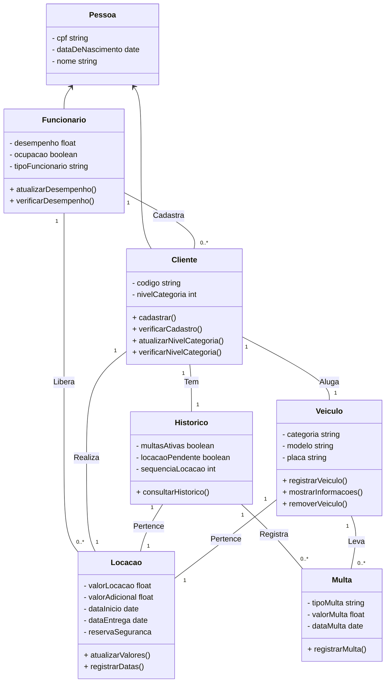

# Modelagem de um sistema para uma locadora de veículos

> Status do projeto: Em andamento

> Este projeto nos foi proposto no 6º semestre na disciplina de Modelagem de Software Orientado a Objetos

> Escrevemos esse projeto juntos durante as aulas

### Tópicos

- [Apresentação](#apresentação)
- [Casos de uso](#casos-de-uso)
- [Diagrama de classes](#diagrama-de-classes)

### Dados temporários

Atores: cliente, atendente, time do pátio, operador, sistema do DETRAN

Classes: Veículo, funcionário, cliente, locação, "multas", 

## Apresentação 

## Casos de uso
### Diagrama de Casos de Uso

### Tabelas de Casos de Uso
| Identificador          | UC_01                                                                                                     |
| :----------------------| :---------------------------------------------------------------------------------------------------------|
| Função                 | Verificar Cadastro                                                                                        |
| Atores                 | Cliente, Atendente                                                                                      |
| Prioridade             | Essencial                                                                                                 |     
| Pré-condição           | Cliente precisa informar o código                                                                         |
| Pós-condição           | Aprovação ou rejeição do cliente                                                                          |
| Fluxo Principal        | - O cliente informa seu código   - O atendente verifica se o cliente já possui cadastro (FS001, FS002) |
| Fluxo Secundário FS001 | - Se o cliente não possuir cadastro, o atendente realiza o procedimento                                   |
| Fluxo Secundário FS002 | - Após confirmar o cadastro do cliente, o atendente verifica se há locações pendentes do cliente (FS003)  |
| Fluxo Secundário FS003 | - Caso o cliente tenha locações pendentes, o atendente deve recusar a locação                             |

| Identificador   | UC_02                                                                               |
| :---------------| :-----------------------------------------------------------------------------------|
| Função          | Alugar veículo                                                                      |
| Atores          | Cliente, Atendente, Time do pátio e Sistema de pagamento                            |
| Prioridade      | Essencial                                                                           |     
| Pré-condição    | Cadastro do cliente liberado                                                        |
| Pós-condição    | Aluguel concluído                                                                   |
| Fluxo Principal | - Recepção do cliente na loja   - O cliente escolhe a categoria e o veículo que melhor atendem às suas preferências   - O cliente realiza o pagamento da locação do veículo por meio de um sistema externo de pagamento   - O time do pátio libera o veículo para o cliente |

| Identificador          | UC_03                                                                                                           |
| :----------------------| :---------------------------------------------------------------------------------------------------------------|
| Função                 | Verificar multas                                                                                                |
| Atores                 | Detran                                                                                                          |
| Prioridade             | Essencial                                                                                                       |     
| Pré-condição           | Devolução do veículo pelo cliente concluída                                                                     |
| Pós-condição           | Conclusão final da locação                                                                                      |
| Fluxo Principal        | - O sistema consulta o Detran para verificar se há multas pendentes no veículo utilizado pelo cliente (FS004)   |
| Fluxo Secundário FS004 | - Caso existam multas pendentes relacionadas ao veículo do cliente, o sistema deve notificar e cobrar o cliente |

## Diagrama de Classes

### Diagrama de Sequência

